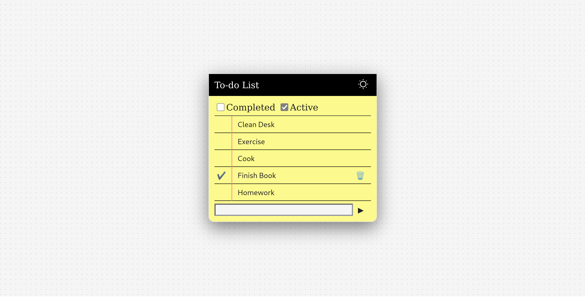
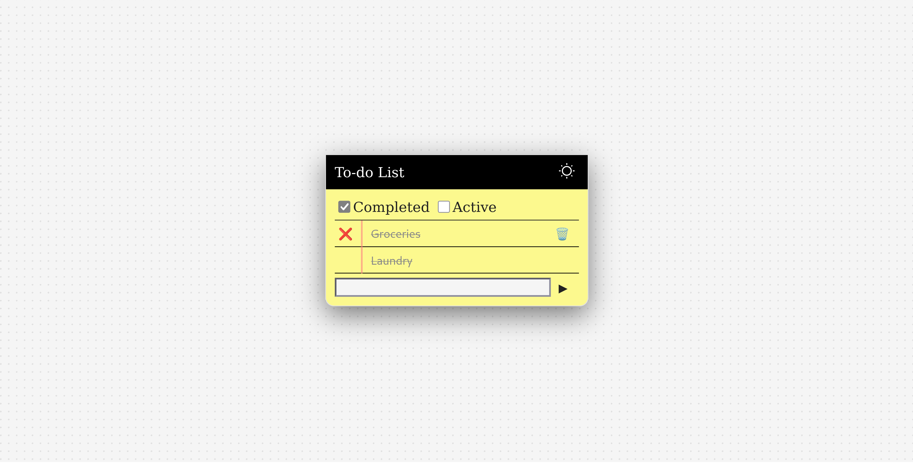
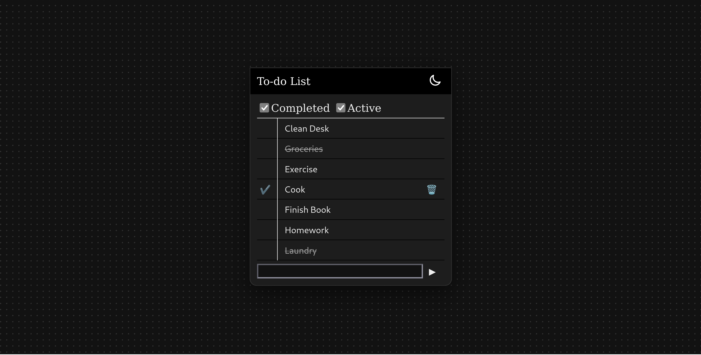
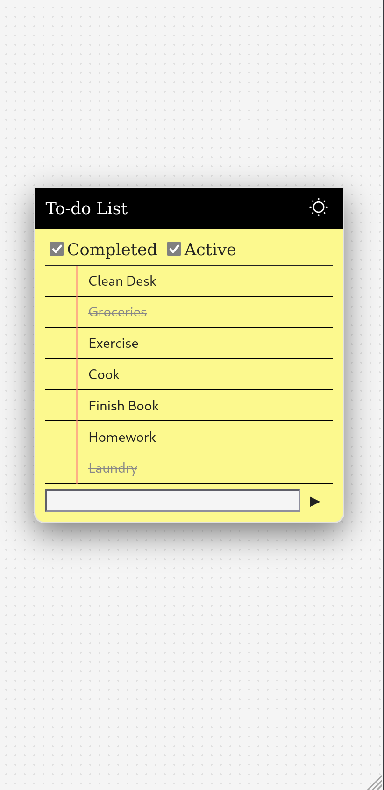
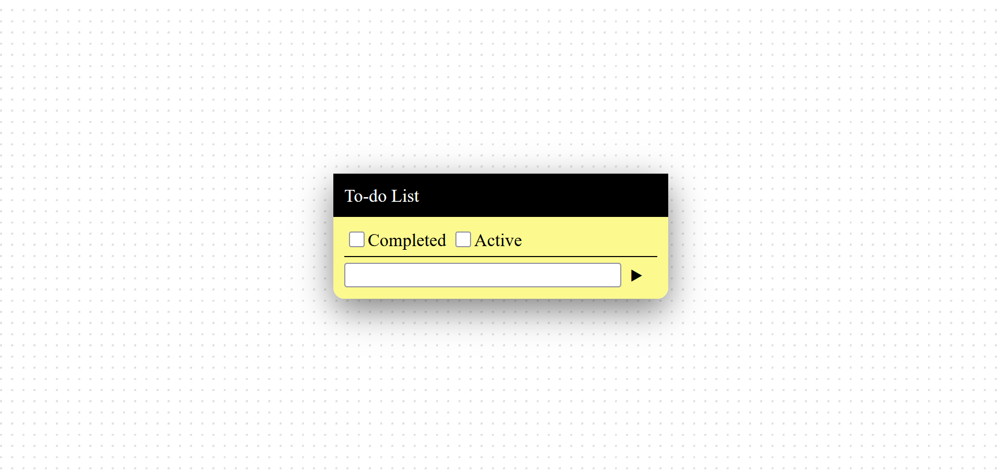

# todo-app

## A simple todo list app built using HTML, CSS and JavaScript.

A browser todo list app that is built to progress my frontend development. This app contain functions:

1. Adding/Marking/Deleting tasks
2. Editing tasks
3. Persistent storage using localStorage
4. Light and Dark Mode

## How it works
- Tasks are stored as objects in an array
- The array is then stored in the localStorage in JSON
- The UI is re-rendered whenever any changes are detected

## Screenshots
### Main Interface

### Active Tasks

### Completed Tasks

### Dark Mode

### Mobile View

  

### Empty Tasks

## How to run
1. Download the project
2. Open index.html

## License
This project is licensed under the [MIT License](LICENSE)