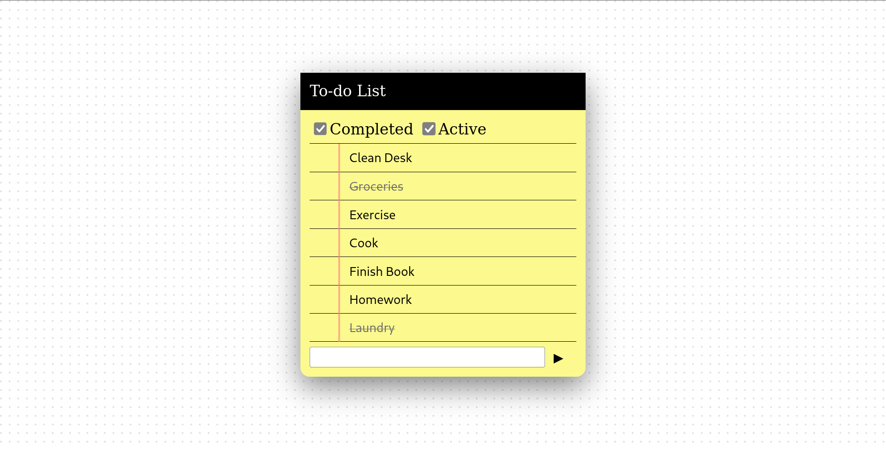
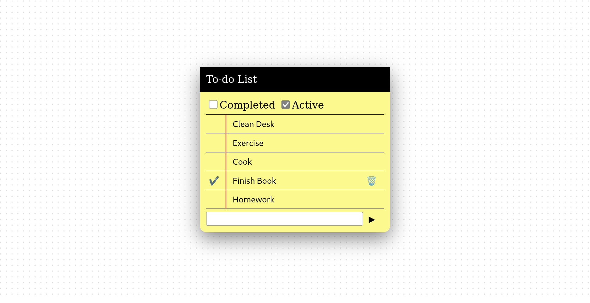
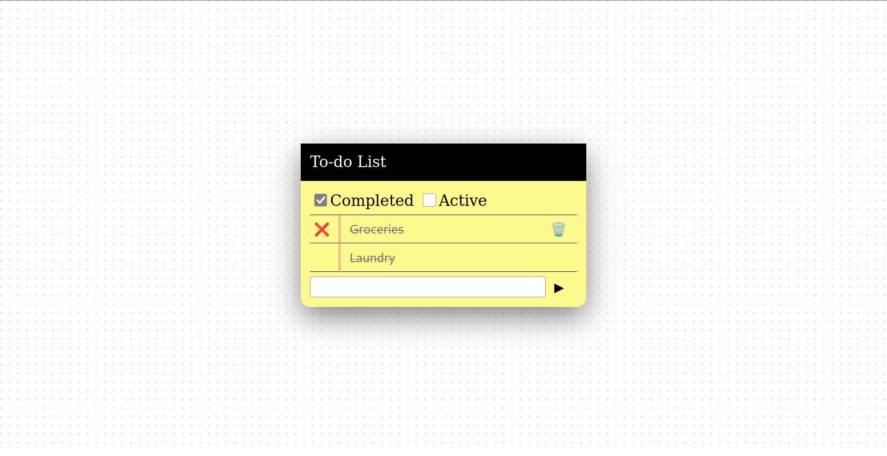
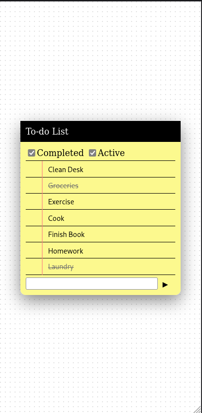

# todo-app

## A simple todo list app made using MongoDB, Express.js and Node.js

A browser todo list app that is built to progress my frontend development. This app contain functions:

1. Adding/Marking/Deleting tasks
2. Editing tasks
3. Stored in MongoDB
4. Used REST API along with Express and Node.js

## How it works
- Tasks are immediately updated into MongoDB
- MongoDB became the only source of truth for any operations.
- The UI is re-rendered whenever any changes are detected

## Screenshots
### Main Interface


### Active Tasks


### Completed Tasks


### Mobile View
<p align="center">
  
</p>

### Empty Tasks


## How to run
1. Download the project
2. Run:

```bash
npm install
```

3. Create .env with:

```bash
MONGO_URI=connection_string
```

4. Run:

```bash
node server/index.js
```

5. Open index.html